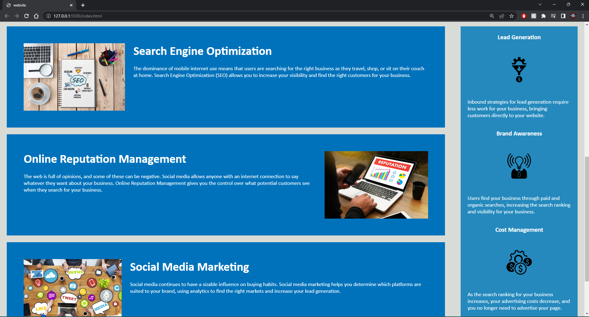
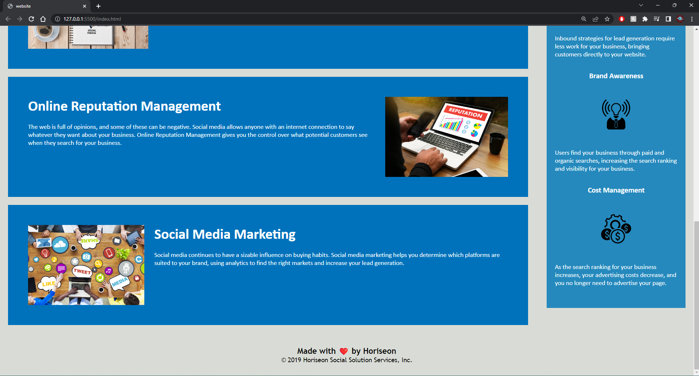

# 01-Semantic-Challenge
This is my first homework assignment for OSU boot camp. Here we had to use semantic html elements and insert them in our source code where they would follow a logical structure independent of styling and positioning.
Here are some screenshots of the website.

Link to the page.
https://kgberry542.github.io/01-Semantic-Challenge/